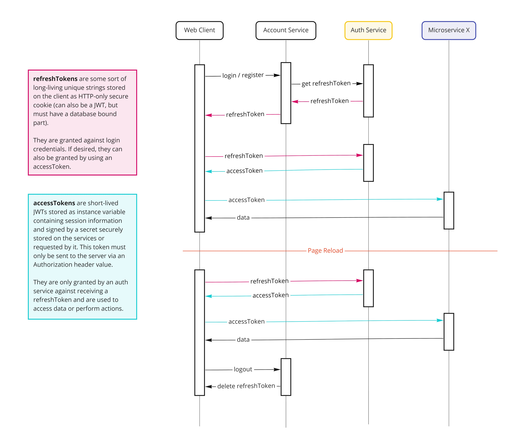
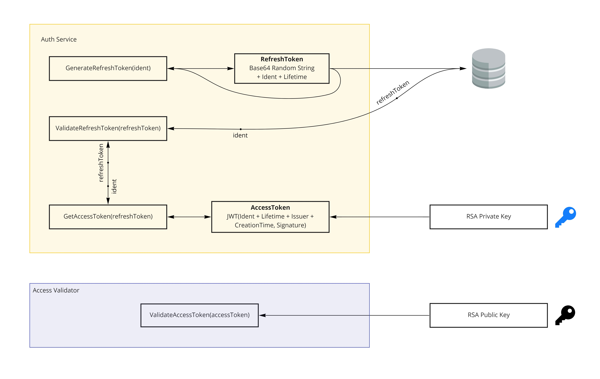

# Refresh Access Token Authorization

This repository represents an example implementation of the refresh access token authorization concept as it is described here in the following article.  
https://auth0.com/blog/refresh-tokens-what-are-they-and-when-to-use-them

## The Concept

I've created a little sequence diagram to visualize the authentication and request flow of the refresh access token authentication.



Derived from the concept, this is the structure of this particular implementation.



## Repository Setup

If you want to try the implementation yourself, you can clone the repository and set up an environment using docker and docker-compose.

```
$ git clone --depth 1 --branch master https://github.com/zekroTutorials/refresh-tokens.git
$ cd refresh-tokens
$ docker-compose build
$ docker-compose up -d
```

Then, navigate to `http://localhost:80` on your system to access the web app.

## Resources

- https://auth0.com/blog/refresh-tokens-what-are-they-and-when-to-use-them
- https://auth0.com/learn/refresh-tokens/
- https://code-maze.com/using-refresh-tokens-in-asp-net-core-authentication/
- https://docs.microsoft.com/en-us/machine-learning-server/operationalize/how-to-manage-access-tokens
- https://medium.com/@dineout2018/refresh-token-with-jwt-authentication-in-node-js-9356328467c7
- https://youtu.be/iD49_NIQ-R4